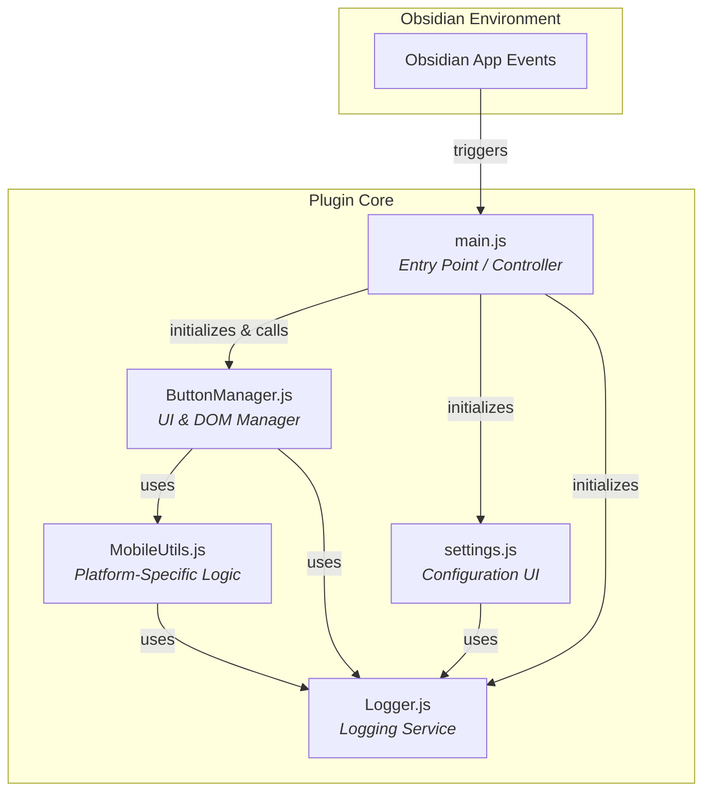

# System Patterns & Architecture

## 1. System Architecture

The plugin follows a modular, event-driven architecture that is well-suited for the Obsidian plugin environment. The core logic is separated into distinct modules, each with a clear responsibility.

* **`main.js` (Controller)**: Acts as the central nervous system. It listens for Obsidian lifecycle events (like opening a note) and delegates tasks to the appropriate managers.
* **`ButtonManager.js` (View/DOM Manager)**: Encapsulates all logic related to creating, styling, showing, hiding, and handling events for the floating button. This is the heart of the plugin's visible functionality.
* **`settings.js` (Settings Controller)**: Responsible for building the settings tab and handling the persistence of user preferences.
* **`MobileUtils.js` (Strategy/Helper)**: Contains specialized logic for the mobile platform. By isolating this complexity, the `ButtonManager` remains clean and focused on its primary task.
* **`Logger.js` (Service)**: A decoupled utility that provides a consistent logging interface for all other modules.

## 2. Key Design Patterns

* **Separation of Concerns**: Each module has a single, well-defined purpose. For example, mobile-specific logic is entirely contained within `MobileUtils.js` and not mixed into the general `ButtonManager.js`.
* **Event-Driven**: The plugin is reactive. It doesn't run continuous loops but instead responds to events emitted by the Obsidian application, such as `active-leaf-change`. This is highly efficient.
* **Strategy Pattern**: The `getEffectiveSettings` method in `ButtonManager` acts as a "strategy" selector. It dynamically chooses which set of rules and logic to apply (desktop vs. mobile) based on the current context, without the calling code needing to know the details.
* **Singleton/Module Pattern**: Each file exports a class or a set of functions, acting as a self-contained module. The `main.js` file creates single instances of the `ButtonManager` and `Logger` to be used throughout the plugin's lifecycle.